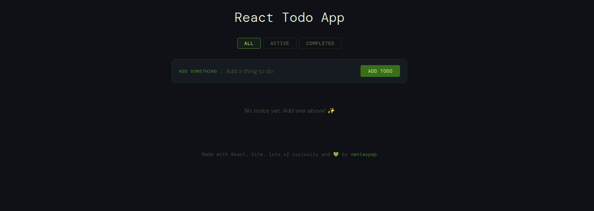

# React Todo App

A clean, minimal todo app built with React and Vite — my first React project.



🔗 **Live demo:** [nwntaspap.github.io/React-ToDo-App](https://nwntaspap.github.io/React-ToDo-App/)

---

## Features

- Add and delete todos
- Mark todos as complete
- Filter by All / Active / Completed
- Item counter that updates as you work
- Empty state when the list is clear

## Tech stack

- [React](https://react.dev/) — UI and state
- [Vite](https://vitejs.dev/) — build tool and dev server
- CSS custom properties — theming and dark palette
- [DM Sans + DM Mono](https://fonts.google.com/) — typography

## Getting started

```bash
# Install dependencies
npm install

# Start the dev server
npm run dev

# Build for production
npm run build
```

## Project structure

```
src/
├── App.jsx          # Root component — state and filter logic
├── TodoForm.jsx     # Controlled input with validation
├── ToDoList.jsx     # Renders the list of items
├── ToDoItem.jsx     # Single todo row with checkbox and delete
├── index.css        # All styles
└── main.jsx         # Entry point
```

## What I learned

This was my first React project. Building it helped me understand:

- Component composition and how to split UI into small pieces
- Lifting state up and passing props down
- Controlled inputs and form handling
- Filtering and deriving data from state instead of storing it separately

---

Made with React, Vite, lots of curiosity and 💚 by [nwntaspap](https://github.com/nwntaspap)
